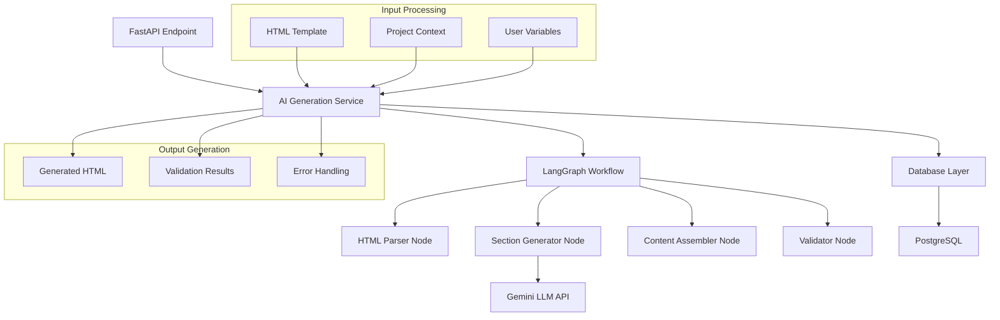

# Design Document

## Overview

The LangGraph Document Generator is a modular AI system that integrates with the existing DocGen application to provide intelligent document generation capabilities. The system uses a section-by-section approach with LangGraph orchestration and Gemini LLM to transform reference documents into new documents with updated content while preserving structure. The design emphasizes modularity, resilience, and seamless integration with the existing HTML-centric workflow.

## Architecture

### High-Level Architecture



### Integration with Existing System

The LangGraph agent integrates with the current DocGen system through:

1. **Database Integration**: Uses existing `Document` model with `ai_content` field
2. **API Integration**: New `/generate` endpoint in the documents router
3. **HTML Processing**: Works with existing HTML parsing and export functionality
4. **Storage Integration**: Leverages existing Supabase storage for file management

## Components and Interfaces

### 1. AI Generation Service (`ai_service.py`)

**Purpose**: Main orchestration layer that interfaces between FastAPI and LangGraph workflow.

**Interface**:
```python
class AIGenerationService:
    async def generate_document(
        self,
        html_template: str,
        project_context: ProjectContext,
        document_id: str
    ) -> GenerationResult
```

**Responsibilities**:
- Input validation and preprocessing
- LangGraph workflow initialization
- Result processing and database updates
- Error handling and logging

### 2. LangGraph Workflow (`workflow.py`)

**Purpose**: Core workflow orchestration using LangGraph nodes.

**Workflow State**:
```python
class WorkflowState(TypedDict):
    html_template: str
    project_context: ProjectContext
    sections: List[DocumentSection]
    generated_sections: List[GeneratedSection]
    final_html: str
    errors: List[str]
    metadata: Dict[str, Any]
```

**Node Structure**:
- `ParseTemplateNode`: Extracts sections from HTML template
- `ForEachSectionNode`: Iterates through sections for processing
- `GenerateSectionNode`: Generates content for individual sections
- `ValidatorNode`: Validates generated HTML and content
- `AssemblerNode`: Reassembles sections into final document
- `ErrorHandlerNode`: Handles failures and provides fallbacks

### 3. HTML Section Parser (`html_parser.py`)

**Purpose**: Intelligent parsing of HTML templates into processable sections.

**Interface**:
```python
class HTMLSectionParser:
    def parse_template(self, html: str) -> List[DocumentSection]
    def identify_section_boundaries(self, soup: BeautifulSoup) -> List[SectionBoundary]
    def extract_section_metadata(self, section: BeautifulSoup) -> SectionMetadata
```

**Section Identification Logic**:
- Heading-based sections (H1, H2, H3, etc.)
- Table-based sections
- List-based sections
- Paragraph groupings
- Custom section markers

### 4. Content Generator (`content_generator.py`)

**Purpose**: Interfaces with Gemini LLM to generate section-specific content.

**Interface**:
```python
class ContentGenerator:
    async def generate_section_content(
        self,
        section: DocumentSection,
        context: ProjectContext
    ) -> GeneratedContent
    
    def build_section_prompt(
        self,
        section: DocumentSection,
        context: ProjectContext
    ) -> str
```

**Prompt Engineering**:
- Section-specific prompt templates
- Context injection strategies
- Structure preservation instructions
- Content adaptation guidelines

### 5. Project Context Handler (`context_handler.py`)

**Purpose**: Processes and manages user input in various formats.

**Interface**:
```python
class ProjectContextHandler:
    def parse_user_input(self, raw_input: UserInput) -> ProjectContext
    def extract_json_overrides(self, prompt_text: str) -> Dict[str, Any]
    def validate_context(self, context: ProjectContext) -> ValidationResult
```

## Data Models

### Core Data Structures

```python
@dataclass
class ProjectContext:
    project_name: str
    project_description: str
    prompt_text: str
    json_overrides: Dict[str, Any]
    strict_vars: Dict[str, Any]

@dataclass
class DocumentSection:
    id: str
    html_content: str
    section_type: SectionType
    metadata: SectionMetadata
    parent_id: Optional[str]
    children: List[str]

@dataclass
class GeneratedSection:
    section_id: str
    original_html: str
    generated_html: str
    generation_metadata: Dict[str, Any]
    validation_status: ValidationStatus

@dataclass
class GenerationResult:
    success: bool
    generated_html: str
    sections_processed: int
    sections_failed: int
    errors: List[str]
    metadata: Dict[str, Any]
```

### Database Schema Extensions

The system will extend the existing `Document` model with additional fields:

```python
# Additional fields for Document model
class Document(Base):
    # ... existing fields ...
    
    # AI-related fields
    html_template = Column(Text, nullable=True)  # Parsed HTML template
    ai_content = Column(Text, nullable=True)     # Generated HTML content
    generation_metadata = Column(JSON, nullable=True)  # Generation details
    project_context = Column(JSON, nullable=True)      # User input context
    generation_status = Column(String(32), default="pending")  # Status tracking
```

## Error Handling

### Error Categories

1. **Input Validation Errors**
   - Invalid HTML template
   - Missing required context fields
   - Malformed JSON overrides

2. **Processing Errors**
   - HTML parsing failures
   - Section extraction issues
   - LLM API failures

3. **Generation Errors**
   - Content generation timeouts
   - Invalid generated content
   - Assembly failures

### Error Handling Strategy

```python
class ErrorHandler:
    def handle_parsing_error(self, error: ParsingError) -> FallbackResult
    def handle_generation_error(self, error: GenerationError) -> RetryResult
    def handle_assembly_error(self, error: AssemblyError) -> RecoveryResult
```

**Fallback Mechanisms**:
- Default content templates for failed sections
- Partial document generation with error annotations
- Graceful degradation with user notifications

## Testing Strategy

### Unit Testing

1. **Component Testing**
   - HTML parser with various document structures
   - Content generator with different context types
   - Context handler with edge cases
   - Error handlers with failure scenarios

2. **Integration Testing**
   - LangGraph workflow end-to-end
   - Database integration
   - API endpoint testing
   - LLM integration testing

### Test Data Strategy

```python
# Test fixtures
@pytest.fixture
def sample_html_template():
    return """
    <h1>Project Overview</h1>
    <p>Project description goes here</p>
    <h2>Tech Stack</h2>
    <table>
        <tr><td>Frontend</td><td>React</td></tr>
        <tr><td>Backend</td><td>FastAPI</td></tr>
    </table>
    """

@pytest.fixture
def sample_project_context():
    return ProjectContext(
        project_name="TestProject",
        project_description="A test project",
        prompt_text="Building a new fintech app...",
        json_overrides={"frontend": "Next.js"},
        strict_vars={}
    )
```

### Performance Testing

- LLM API response time monitoring
- Section processing throughput
- Memory usage during large document processing
- Concurrent request handling

## Security Considerations

### Input Sanitization

- HTML template sanitization using `bleach`
- User input validation and escaping
- JSON override validation
- SQL injection prevention

### API Security

- Rate limiting for generation endpoints
- Authentication and authorization
- Input size limits
- Resource usage monitoring

### LLM Security

- Prompt injection prevention
- Content filtering
- API key management
- Usage monitoring and limits

## Monitoring and Observability

### Logging Strategy

```python
# Structured logging for AI operations
logger.info("Starting document generation", extra={
    "document_id": document_id,
    "sections_count": len(sections),
    "context_type": context.get_type()
})
```

### Metrics Collection

- Generation success/failure rates
- Processing time per section
- LLM API usage and costs
- Error frequency by type
- User satisfaction indicators

### Health Checks

- LLM API connectivity
- Database connection status
- Workflow node health
- Resource utilization monitoring

## Deployment Considerations

### Dependencies

New dependencies to add to `requirements.txt`:
```
langgraph>=0.0.40
langchain-google-genai>=1.0.0
langchain-core>=0.1.0
pydantic>=2.0.0
tenacity>=8.0.0
```

### Configuration

Environment variables for AI system:
```python
# AI Configuration
GEMINI_API_KEY=your_gemini_api_key
AI_GENERATION_TIMEOUT=300
MAX_SECTIONS_PER_DOCUMENT=50
ENABLE_CONTENT_VALIDATION=true
DEFAULT_GENERATION_MODEL=gemini-pro
```

### Scalability

- Async processing for LLM calls
- Section-level parallelization
- Caching for repeated patterns
- Resource pooling for concurrent requests